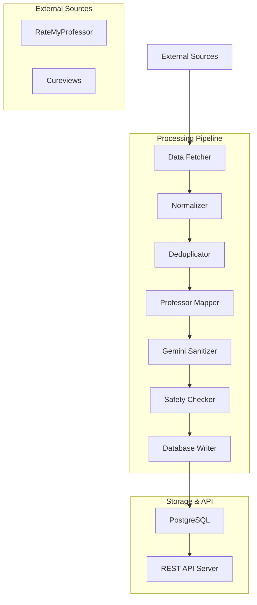
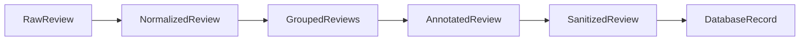

# Design Document

## Overview

The review sanitization pipeline is a Node.js-based data processing system that operates as a Kiro workflow job. It fetches professor reviews from external sources, applies multi-stage sanitization using AI, and provides a REST API for the Cornell professor game. The system prioritizes privacy, data quality, and deterministic processing to ensure consistent results across runs.

## Architecture

### High-Level Architecture



### Component Architecture

The system follows a modular pipeline architecture with the following components:

1. **Data Fetchers**: Modular scrapers for each review source
2. **Processing Engine**: Sequential data transformation pipeline
3. **AI Sanitizer**: Gemini API integration with retry logic
4. **Database Layer**: PostgreSQL with connection pooling
5. **REST API**: Express.js server for read-only access
6. **Workflow Orchestrator**: Kiro job runner with error handling

## Components and Interfaces

### 1. Data Fetcher Module

**Purpose**: Fetch reviews from external sources with configurable authentication

**Interface**:
```typescript
interface ReviewFetcher {
  fetchReviews(school: string, options?: FetchOptions): Promise<RawReview[]>
}

interface RawReview {
  source: 'ratemyprof' | 'cureviews'
  source_id: string
  prof_source_id: string
  text: string
  rating?: number
  source_meta?: Record<string, any>
}
```

**Implementation Strategy**:
- RateMyProfessor: Use `ratemyprof-api` npm package or HTTP scraping
- Cureviews: Direct API integration if available, fallback to scraping
- Configurable rate limiting and retry logic
- Support for both authenticated and unauthenticated access

### 2. Text Normalizer

**Purpose**: Clean and standardize review text before sanitization

**Interface**:
```typescript
interface TextNormalizer {
  normalize(review: RawReview): NormalizedReview | null
}

interface NormalizedReview extends RawReview {
  normalized_text: string
  char_length: number
}
```

**Processing Steps**:
- Strip HTML tags using `cheerio`
- Decode HTML entities
- Collapse multiple whitespace characters
- Remove control characters
- Apply length filters (30-3000 characters)
- Pre-sanitize obvious PII patterns with regex

### 3. Deduplication Engine

**Purpose**: Remove duplicate reviews and group by professor

**Interface**:
```typescript
interface Deduplicator {
  deduplicate(reviews: NormalizedReview[]): GroupedReviews
}

interface GroupedReviews {
  [prof_source_id: string]: NormalizedReview[]
}
```

**Algorithm**:
- Generate SHA256 hash of `normalized_text + source`
- Use Set-based deduplication for O(n) performance
- Group remaining reviews by `prof_source_id`
- Maintain insertion order for deterministic processing

### 4. Professor Mapper

**Purpose**: Create deterministic professor placeholder mappings

**Interface**:
```typescript
interface ProfessorMapper {
  mapProfessors(groupedReviews: GroupedReviews): Promise<ProfessorMapping>
}

interface ProfessorMapping {
  [prof_source_id: string]: {
    internal_code: string
    professor_id: string
  }
}
```

**Algorithm**:
- Extract unique `prof_source_id` values
- Sort lexicographically for deterministic ordering
- Generate `PROF_001`, `PROF_002`, etc. based on sorted position
- Upsert professor records in database
- Return mapping for review annotation

### 5. Gemini Sanitizer

**Purpose**: AI-powered PII removal with structured output

**Interface**:
```typescript
interface GeminiSanitizer {
  sanitizeBatch(reviews: AnnotatedReview[]): Promise<SanitizedReview[]>
}

interface SanitizedReview {
  id: string
  sanitized_text: string
  redacted_types: string[]
  sanitization_replacements: Record<string, string>
  confidence: number
  safety_flag: 'ok' | 'pii_found' | 'manual_reject'
}
```

**Implementation Details**:
- Use Google Generative AI SDK
- Process reviews in configurable batches (default: 20)
- Implement exponential backoff retry (1s, 2s delays)
- Parse structured JSON responses
- Handle malformed responses gracefully

### 6. Safety Checker

**Purpose**: Additional validation layer for sanitized content

**Interface**:
```typescript
interface SafetyChecker {
  checkSafety(review: SanitizedReview): SafetyResult
}

interface SafetyResult {
  passed: boolean
  issues: string[]
  updated_flag: string
}
```

**Validation Rules**:
- Regex patterns for names: `/[A-Z][a-z]{2,}\s[A-Z][a-z]{2,}/`
- Email patterns: `/\b[A-Za-z0-9._%+-]+@[A-Za-z0-9.-]+\.[A-Z|a-z]{2,}\b/`
- Phone patterns: `/\b\d{3}[-.]?\d{3}[-.]?\d{4}\b/`
- URL patterns: `/https?:\/\/[^\s]+/`
- Allegation keywords: configurable list

### 7. Database Layer

**Purpose**: Persistent storage with optimized schema

**Schema Design**:
```sql
-- Professors table (internal mapping)
CREATE TABLE professors (
  id UUID PRIMARY KEY DEFAULT gen_random_uuid(),
  source_prof_id TEXT,
  school TEXT,
  dept TEXT,
  internal_prof_code TEXT UNIQUE,
  created_at TIMESTAMPTZ DEFAULT now()
);

-- Reviews table (sanitized content)
CREATE TABLE reviews (
  id UUID PRIMARY KEY DEFAULT gen_random_uuid(),
  professor_id UUID REFERENCES professors(id),
  sanitized_text TEXT NOT NULL,
  rating NUMERIC(2,1),
  length INT GENERATED ALWAYS AS (char_length(sanitized_text)) STORED,
  source TEXT,
  source_meta JSONB,
  sanitization_version TEXT,
  sanitized_at TIMESTAMPTZ DEFAULT now(),
  safety_flag TEXT DEFAULT 'ok'
);

-- Indexes for performance
CREATE INDEX idx_reviews_professor_id ON reviews(professor_id);
CREATE INDEX idx_reviews_source ON reviews(source);
CREATE INDEX idx_reviews_safety_flag ON reviews(safety_flag);
CREATE INDEX idx_professors_code ON professors(internal_prof_code);
```

### 8. REST API Server

**Purpose**: Read-only access to sanitized data

**Endpoints**:
```typescript
// Get random reviews for game modes
GET /api/reviews?mode={guess|realorfake}&count=10
Response: {
  reviews: Array<{
    id: string
    professor_code: string
    sanitized_text: string
    rating?: number
    source: string
  }>
}

// Get professor mappings
GET /api/professors?school=Cornell&limit=200
Response: {
  professors: Array<{
    internal_prof_code: string
    school: string
  }>
}

// Health check
GET /api/health
Response: { status: 'ok', timestamp: string }
```

## Data Models

### Core Data Flow



### Data Transformations

1. **Raw → Normalized**: Text cleaning and validation
2. **Normalized → Grouped**: Deduplication and professor grouping
3. **Grouped → Annotated**: Professor placeholder assignment
4. **Annotated → Sanitized**: AI-powered PII removal
5. **Sanitized → Database**: Persistence with metadata

### Configuration Model

```typescript
interface PipelineConfig {
  // Data sources
  rmp_api_key?: string
  cureviews_api_key?: string
  
  // AI sanitization
  gemini_api_key: string
  gemini_model: string
  batch_size: number
  
  // Database
  database_url: string
  
  // Processing options
  school: string
  sanitization_version: string
  min_review_length: number
  max_review_length: number
  
  // Retry settings
  max_retries: number
  retry_delay_ms: number
}
```

## Error Handling

### Retry Strategy

1. **Gemini API Failures**: Exponential backoff (1s, 2s, fail)
2. **Database Failures**: Immediate retry once, then log and continue
3. **Network Failures**: Linear backoff with jitter
4. **Parsing Failures**: Log error details and skip batch

### Error Recovery

- **Partial Batch Failures**: Process successful items, log failures
- **Database Connection Loss**: Reconnect with exponential backoff
- **Rate Limiting**: Respect API limits with adaptive delays
- **Memory Issues**: Process in smaller batches if OOM detected

### Logging Strategy

```typescript
interface LogEntry {
  timestamp: string
  level: 'info' | 'warn' | 'error'
  component: string
  message: string
  metadata?: Record<string, any>
}
```

## Testing Strategy

### Unit Tests

- **Data Fetchers**: Mock external APIs, test error handling
- **Text Normalizer**: Test edge cases, HTML handling, length filters
- **Deduplicator**: Test hash consistency, grouping logic
- **Professor Mapper**: Test deterministic mapping, database upserts
- **Sanitizer**: Mock Gemini responses, test retry logic
- **Safety Checker**: Test regex patterns, keyword detection

### Integration Tests

- **End-to-End Pipeline**: Small dataset processing
- **Database Operations**: Schema validation, constraint testing
- **API Endpoints**: Response format validation, error handling
- **Gemini Integration**: Real API calls with test data

### Acceptance Tests

1. **Data Quality**: 90% safety_flag = 'ok' requirement
2. **PII Removal**: Regex validation on sanitized output
3. **API Functionality**: Endpoint response validation
4. **Deterministic Mapping**: Consistency across runs
5. **Performance**: Processing time benchmarks

### Test Data Strategy

- **Synthetic Reviews**: Generated test data with known PII
- **Anonymized Samples**: Real review structure without PII
- **Edge Cases**: Malformed input, empty responses, special characters
- **Load Testing**: Batch processing with large datasets

## Performance Considerations

### Scalability

- **Batch Processing**: Configurable batch sizes for memory management
- **Database Pooling**: Connection reuse for high throughput
- **Async Processing**: Non-blocking I/O for external API calls
- **Memory Management**: Streaming for large datasets

### Optimization

- **Database Indexes**: Optimized queries for API endpoints
- **Caching**: In-memory professor mapping cache
- **Rate Limiting**: Respect external API limits
- **Parallel Processing**: Concurrent batch processing where safe

### Monitoring

- **Metrics Collection**: Processing rates, error rates, API latency
- **Health Checks**: Database connectivity, API availability
- **Resource Usage**: Memory consumption, CPU utilization
- **Data Quality**: Sanitization success rates, safety flag distribution